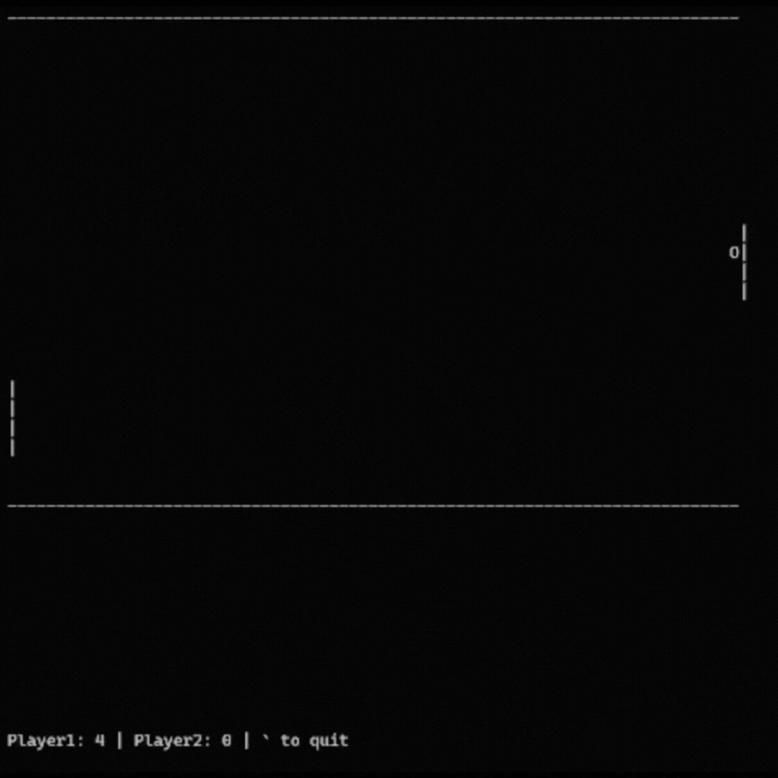

# Pong

So, this game is obviously a remake of the well-known game Pong.


## Sneak peek

PS: The recording FPS makes the game look...epileptic? I promise it's not that bad IRL :)




## Motivation

University classes are too slow so hopefully this game will help reduce b o r e d o m.

Also taught me a bit about C++, OOP, and multithreading.


## Requirements

### OS

Courtesy of the use of `ncurses`. (Sorry not sorry!)

Any of:

- Any Linux distro
- OSX 


### Other

- C++ compiler with C++17 support

**Note**: This game has only been tested on WSL2, running Ubuntu 24.04.03 LTS.


## Installation

To install, simply run:

```bash
git clone https://github.com/minip8/pong
cd pong
make
```


## The AI

The AI always plays the left paddle.

Initially, the goal was to train a model through reinforcement learning to play the game. However, I decided it would be funny if an AI just moved to exactly where the ball would land every time, since the physics of the game allows for deterministic prediction.


## Controls

Unfortunately (?), controls are toggle-style. In other words, holding a key down is unecessary as pressing it once will move the paddle consistently upwards until the down key is pressed. See further elaboration in [Game Design](#game-design).

### Left player

`p`: Up <br>
`l`: Down <br>

### Right Player

`q`: Up <br>
`a`: Down <br>

### Single-Player

The AI will be the left player, so the controls will be the same as the right player.


## Game Design

### Refresh rate

Everything is tied to the game's internal `FPS`, which is set to a default of 60.


### Controls

Toggle controls were chosen since the inputs are read via `getch()` which is unable to register simultaneous key presses if multiple players are playing.


### AI

The AI runs on its own thread, performing calculations at a rate of every `1 / FPS` seconds.

The AI is able to calculate the target position in `O(1)` time through *maths*.